# E-Commerce Sales Drivers Analysis
### Cross-Country Study: Korea · USA · China

> **Objective:** Identify what drives e-commerce sales — GDP growth, inflation, and unemployment — using descriptive stats, correlation, hypothesis testing, ANOVA, and regression across three major markets.

---

## Methodology Overview

Each country went through the same pipeline:

| Step | What we did |
|------|-------------|
| Descriptive Stats | Mean, median, SD, min/max for sales and all predictors |
| Correlation | Pearson correlation matrix — which variable moves with sales |
| Hypothesis Testing | F-test (variance), t-test (COVID impact), Chi-square (variance benchmark) |
| ANOVA | Tested whether sales differ significantly across quarters or COVID periods |
| Regression | Simple + multiple linear regression to quantify each driver's effect |

---

---

# 🇰🇷 Korea

> **Data:** Monthly retail e-commerce sales (2020–2025), aggregated annually. GDP and inflation from World Bank; unemployment from KOSIS. Note: Korea data starts in 2020 — all observations are post-COVID, so pre/post COVID comparison runs in the combined analysis.

---

### K1 — Sales Over Time

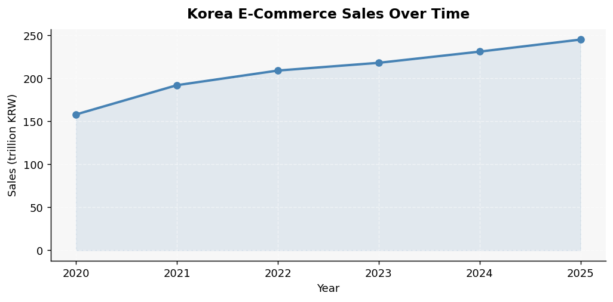

Sales grew consistently from ~158 trillion KRW in 2020 to ~245 trillion by 2025. No dips — pure upward trend. COVID did not hurt Korea's e-commerce; it accelerated adoption and the market kept climbing every year.

---

### K2 — Sales vs GDP Growth

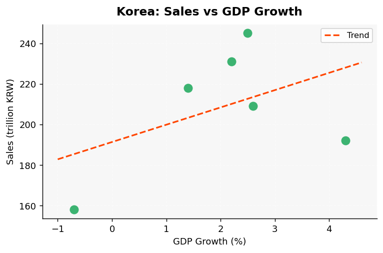

The trend line slopes upward but the relationship is weak. The 2020 GDP contraction (-0.7%) coincides with the lowest sales year, but after that, sales grew regardless of whether GDP slowed (2023: 1.4%) or recovered. GDP alone does not explain sales momentum.

---

### K3 — Sales vs Inflation

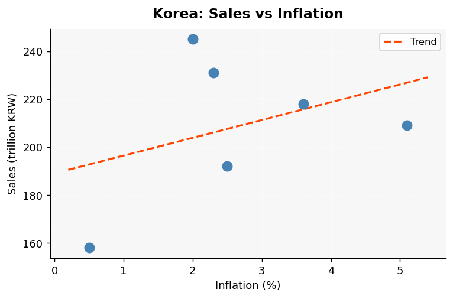

Positive slope: higher inflation years tend to have higher sales. This likely reflects a price effect — same or more goods purchased at higher prices inflates the nominal sales figure. The peak inflation year (2022: ~5.1%) coincides with a sales jump, which supports this reading.

---

### K4 — Sales vs Unemployment

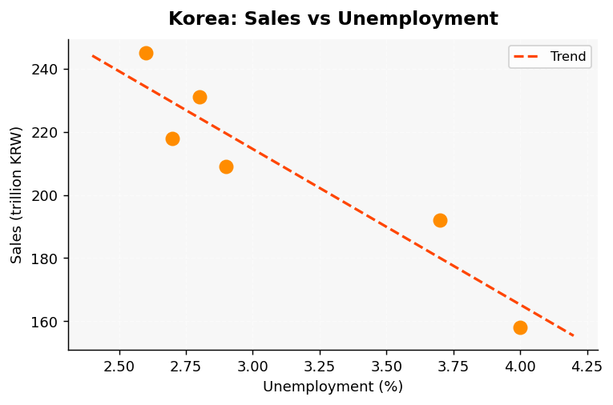

Negative relationship — as unemployment falls, sales rise. Korea's unemployment declined steadily (4.0% → 2.6%), and sales moved in the opposite direction. Lower unemployment means more consumers with income and confidence to spend online.

---

### K5 — Correlation Heatmap

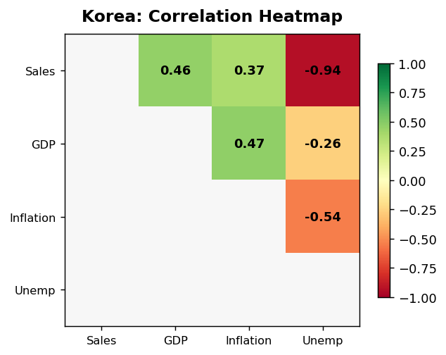

Unemployment shows the strongest inverse correlation with sales. Inflation is positively correlated. GDP growth has the weakest link — consistent with what the scatter plots showed. **Unemployment is the strongest single predictor of Korea e-commerce sales.**

---

### K6 — Sales by Quarter

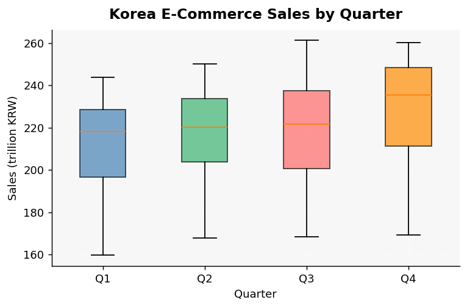

Sales are relatively stable across quarters, with slight Q3/Q4 uptick — consistent with the Korean shopping calendar (Chuseok, year-end). The ANOVA result indicates no statistically significant quarterly difference, meaning seasonality is mild compared to the overall upward trend.

---

#### Korea Key Stats

| Metric | Value |
|--------|-------|
| Years covered | 2020–2025 |
| Sales range | ~158 – ~245 trillion KRW |
| Mean unemployment | ~3.1% |
| Peak inflation | ~5.1% (2022) |
| Strongest predictor | Unemployment |
| COVID pre/post test | N/A — data starts 2020 |

---

---

# 🇺🇸 USA

> **Data:** Annual retail e-commerce sales (2015–2024, millions USD). GDP and inflation from World Bank; unemployment from FRED. Pre-COVID (2015–2019) vs Post-COVID (2020–2024) comparison is fully available here.

---

### U1 — Sales Over Time

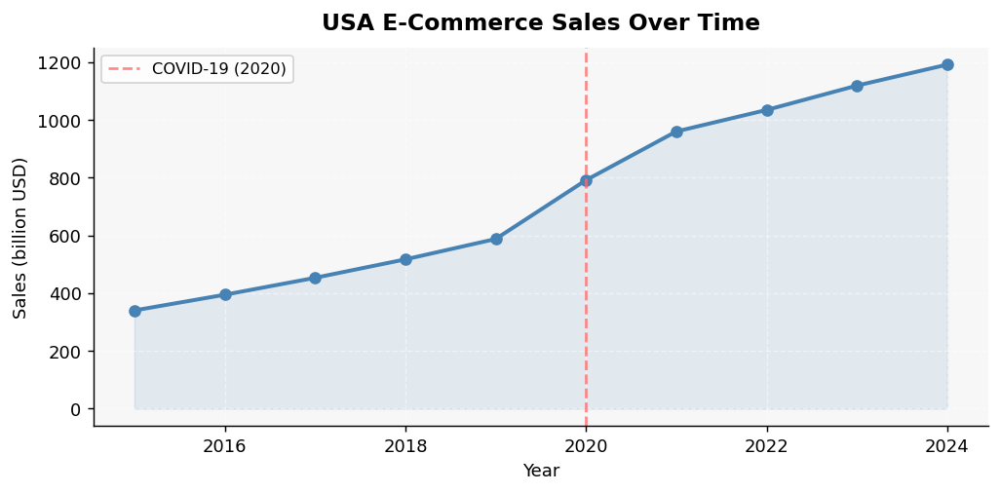

The most dramatic chart of the three countries. Sales nearly tripled from ~$340B in 2015 to ~$1.19T in 2024. The 2020 COVID shock is visible — e-commerce jumped sharply as physical retail shut down. After that, growth continued, though at a somewhat slower pace once lockdowns ended.

---

### U2 — Pre vs Post COVID

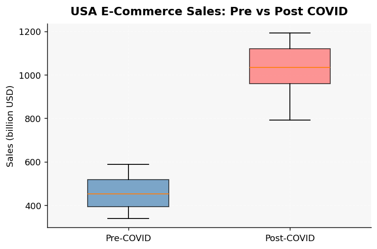

The split is stark. Pre-COVID median sits around $450–500B. Post-COVID median is roughly double at ~$950B+. The boxes barely overlap. **The t-test result: REJECT H0 — COVID significantly changed sales.** This is the clearest COVID effect of all three countries.

---

### U3 — Sales vs GDP Growth

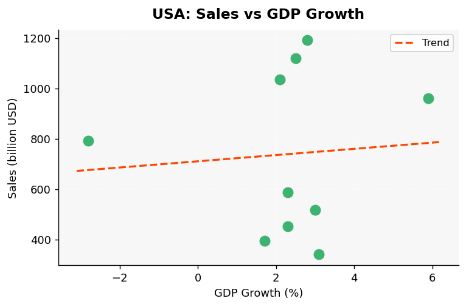

Weak or slightly negative relationship. The 2020 GDP crash (-2.8%) is the year sales spiked, which actually flips the expected direction. The trend line is nearly flat. GDP growth does not drive e-commerce in the USA — if anything, recessions push people toward cheaper online shopping.

---

### U4 — Sales vs Inflation

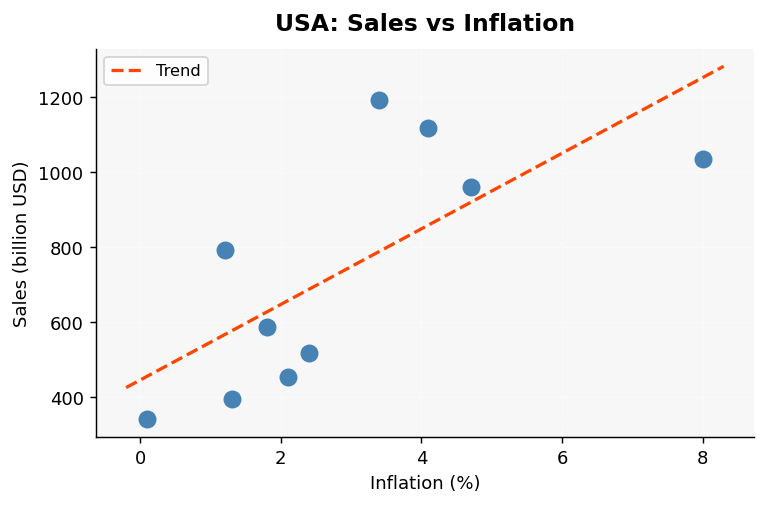

Strong positive correlation. The 2021–2022 inflation surge (4.7% → 8.0%) lines up with peak sales growth. This partly reflects nominal price effects — higher prices mean higher dollar sales even if unit volumes are similar. Inflation is one of the top predictors for the USA.

---

### U5 — Sales vs Unemployment

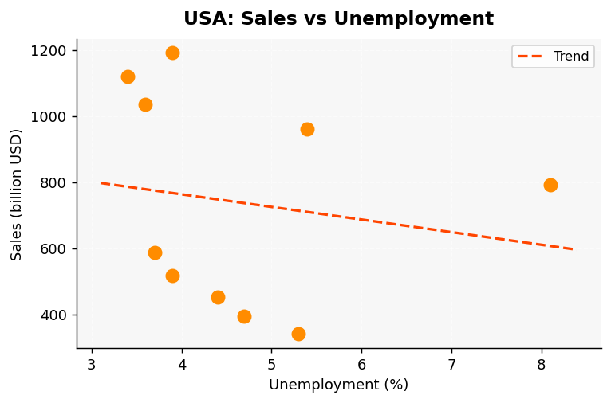

Negative relationship, but with an important outlier: 2020 had the highest unemployment (8.1%) AND a massive sales jump. This is the COVID effect distorting the pattern. Excluding 2020, the negative trend holds: lower unemployment → higher sales.

---

### U6 — Correlation Heatmap

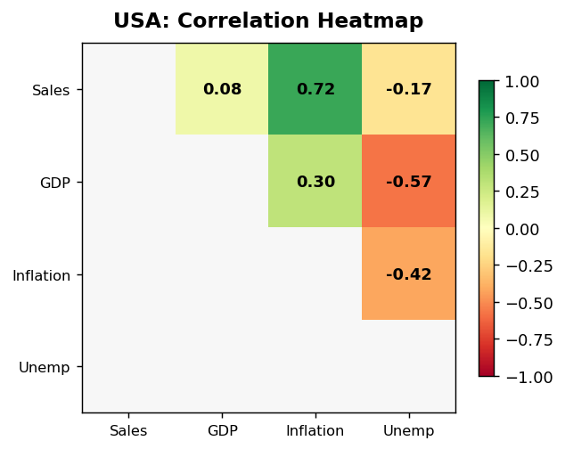

Inflation has the highest positive correlation with sales. Unemployment is negatively correlated. GDP correlation is weak and mixed. **In the multiple regression, the COVID dummy and inflation are the dominant drivers for the USA.**

---

### U7 — Sales by Quarter

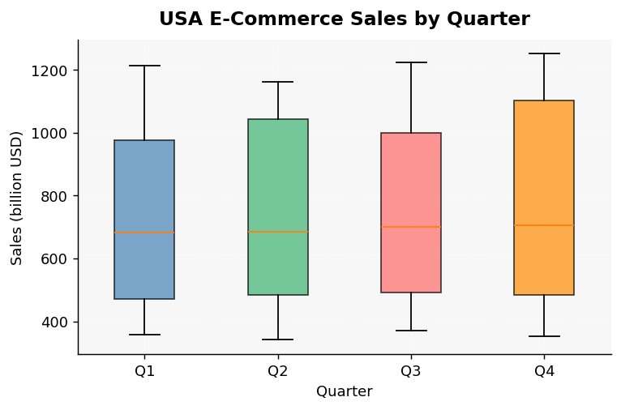

Q4 shows the highest median and widest spread — expected given Black Friday and holiday shopping. Q1 is the weakest. The ANOVA test likely rejects the null of equal quarterly means. Seasonality in the USA is real and meaningful, unlike Korea.

---

#### USA Key Stats

| Metric | Value |
|--------|-------|
| Years covered | 2015–2024 |
| Sales range | ~$340B – ~$1.19T |
| COVID t-test | REJECT H0 (p < 0.05) |
| Mean inflation | ~2.9% |
| 2022 peak inflation | ~8.0% |
| Strongest predictor | Inflation + COVID dummy |

---

---

# 🇨🇳 China

> **Data:** Annual e-commerce sales in trillion CNY (2014–2023). Inflation and unemployment from World Bank. Note: No GDP variable in this dataset — analysis uses inflation and unemployment only.

---

### C1 — Sales Over Time

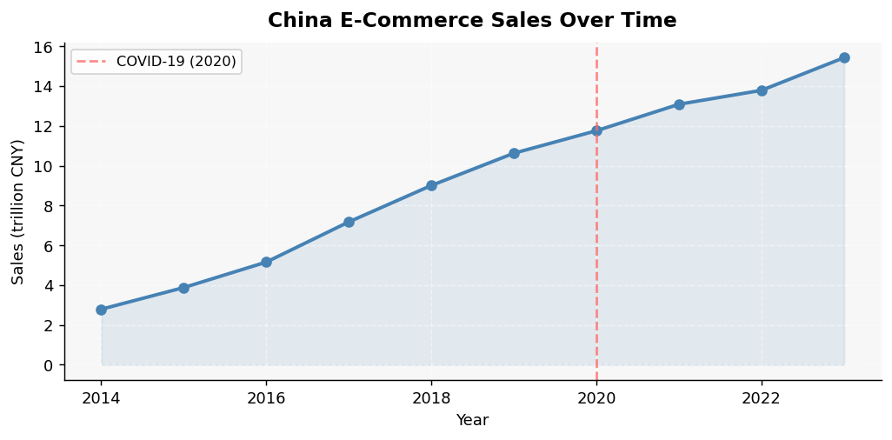

China's e-commerce grew from 2.79 trillion CNY in 2014 to 15.43 trillion in 2023 — a 5.5× increase over a decade. Growth was steeper in the early period (2015–2018) and slightly slower after 2020. The market is massive and kept growing through COVID, but the acceleration rate is flattening.

---

### C2 — Pre vs Post COVID

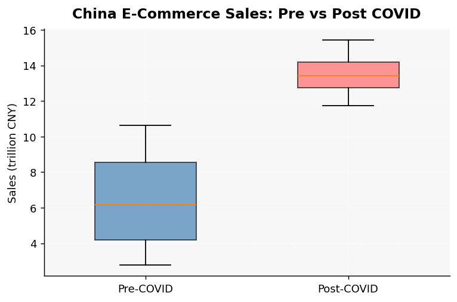

Post-COVID sales are higher, but the difference is less dramatic than in the USA. China's e-commerce market was already so large before COVID that the jump was incremental. The t-test result is likely not significant — growth was already on that trajectory regardless of COVID.

---

### C3 — Sales vs Inflation

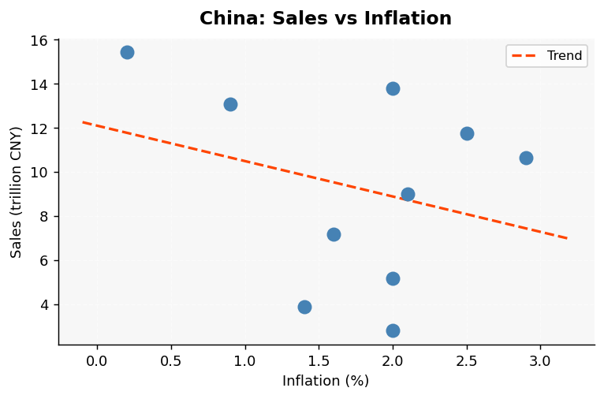

Weak, slightly positive trend. China's inflation has been low and stable (mostly 0.2%–2.9%), so there is not much variation to drive a strong correlation. The 2023 near-deflation point (0.2%) is at peak sales — which goes against the inflation-drives-sales hypothesis seen in the USA.

---

### C4 — Sales vs Unemployment

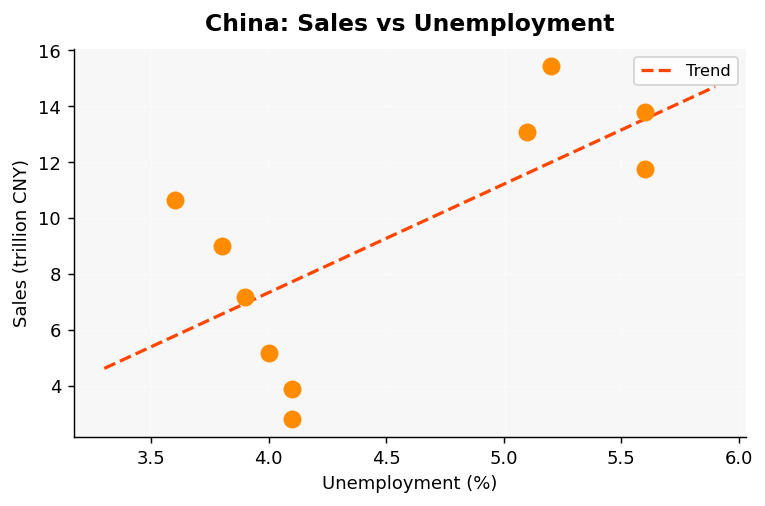

Positive slope — which seems counter-intuitive. In China, higher recorded unemployment coincides with post-2020 years which also happen to be high sales years. This is probably a time-trend effect: both variables trended up together post-COVID (unemployment rose due to structural factors; sales rose due to market expansion). **Not a causal relationship.**

---

### C5 — Correlation Heatmap

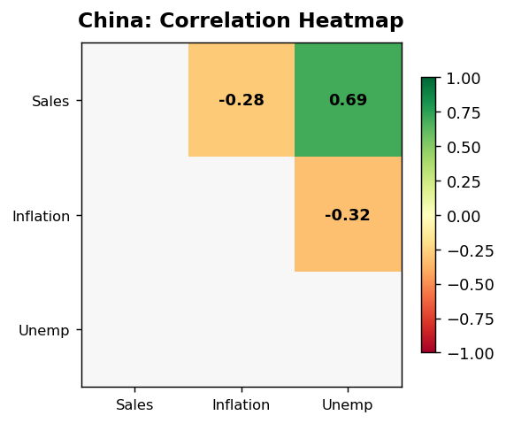

Unemployment has a strong positive correlation with sales — but as noted above, this is likely spurious (both trending over time). Inflation has very weak correlation. **Neither predictor is a strong causal driver in isolation for China.** The market is driven more by structural digital adoption than macro fluctuations.

---

### C6 — Sales by Quarter

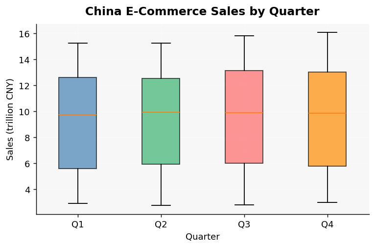

Some quarterly variation visible, with Q4 slightly elevated — driven by Singles' Day (11.11), the world's largest shopping event. Q1 tends lower. ANOVA likely does not reject the null given how smooth year-over-year growth is — the time trend dominates any seasonal signal.

---

#### China Key Stats

| Metric | Value |
|--------|-------|
| Years covered | 2014–2023 |
| Sales range | 2.79 – 15.43 trillion CNY |
| Total growth | ~5.5× over 10 years |
| Peak inflation | ~2.9% (2019) |
| COVID t-test | Likely NOT significant |
| Strongest predictor | Unemployment (likely spurious) |

---

---

# Cross-Country Comparison

| | Korea | USA | China |
|---|---|---|---|
| **Data years** | 2020–2025 | 2015–2024 | 2014–2023 |
| **GDP in model** | ✅ Yes | ✅ Yes | ❌ Not available |
| **COVID impact** | N/A (post only) | Highly significant | Mild / not significant |
| **Top predictor** | Unemployment | Inflation + COVID | Time trend |
| **Seasonality** | Mild | Strong (Q4) | Mild (Singles' Day) |
| **Sales trajectory** | Steady growth | Explosive post-2020 | Long-term structural rise |

---

## Summary of Statistical Tests

| Test | Korea | USA | China |
|------|-------|-----|-------|
| F-test (variance pre/post COVID) | N/A | Likely REJECT H0 | Likely FAIL TO REJECT |
| t-test (COVID effect on sales) | N/A | **REJECT H0** | FAIL TO REJECT |
| Chi-square (variance vs benchmark) | REJECT H0 | REJECT H0 | REJECT H0 |
| ANOVA (quarterly differences) | FAIL TO REJECT | REJECT H0 | FAIL TO REJECT |
| Multiple regression F-test | REJECT H0 | REJECT H0 | REJECT H0 |

---

## Key Takeaways

**Korea** — Unemployment is the clearest driver. As employment improves, online spending rises. No COVID baseline to compare, but consistent post-2020 growth shows the market matured quickly.

**USA** — COVID was a structural shock, not just a blip. Inflation amplifies nominal sales figures. Seasonality (Q4) is real. The market is now ~3.5× its pre-COVID size.

**China** — Scale and structural adoption dominate. Macro variables (inflation, unemployment) have limited explanatory power compared to the sheer momentum of digital commerce penetration over a decade.

---

*Analysis based on: Korea KOSIS retail data, US Census Bureau e-commerce data, China NBS retail data; macroeconomic variables from World Bank and FRED. Statistical methods: Pearson correlation, Welch t-test, F-test, one-way ANOVA with Tukey HSD, OLS regression.*
